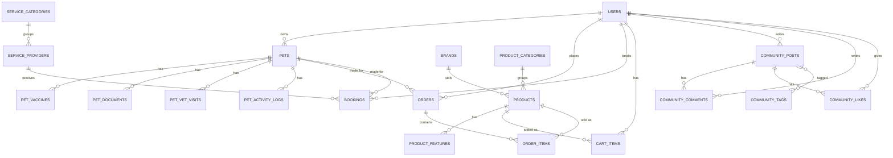

# Модель данных Lucky Paul

Схема БД в `database/schema.sql` (+ стартовые справочники в `database/seed.sql`) спроектирована по сущностям, которые уже есть в кликабельном прототипе (`prototype/lucky-paul.html`): `PRODUCTS`, `PETS`, `SERVICES`, `COMMUNITY_POSTS` и связанные с ними структуры (вакцины, документы, заказы, бронирования, комментарии).

## ER-диаграмма

## Как сущности прототипа легли в таблицы

| В прототипе (JS) | В БД | Комментарий |
|---|---|---|
| `PETS.rex.stats` (Вес/Активность/Осмотр/Вакцина) | `pets.weight_kg` + `pet_activity_logs` + `pet_vet_visits` + `pet_vaccines` | В прототипе это статичный массив; в реальном приложении — вычисляемые витрины поверх отдельных таблиц (последний осмотр = `MAX(visit_date)`, следующая вакцина = `MIN(next_date)`) |
| `PETS.rex.vaccines[]` | `pet_vaccines` | 1:N от `pets` |
| `PETS.rex.docs[]` | `pet_documents` | 1:N от `pets`, `file_url` — ссылка на объект в файловом хранилище (S3/Cloud Storage), не сам файл |
| `PETS.rex.orders[]` / `ordersTotal` | `orders` + `order_items` | В прототипе заказ — одна строка текста ("TZ-2022 Поводок × 1, Royal Canin ×1"); в реальной схеме это `orders` с несколькими `order_items` |
| `PETS.rex.bookings[]` | `bookings` | Связывает `pets` + `service_providers` + `users` |
| `PRODUCTS[]` (`owner: 'own'/'partner'`) | `products` + `brands` (`kind: own/partner`) | Разделение "свой бренд / партнёрский" — это тип бренда, а не товара |
| `PRODUCTS[].features[]` | `product_features` | 1:N, с `sort_order` для сохранения порядка из прототипа |
| `PRODUCTS[].tag: 'soon'` | `products.tag = 'soon'` + `is_available = false` | Товары в разработке (GPS-линейка) видны в каталоге, но недоступны к заказу |
| `cart` (JS-объект в памяти) | `cart_items` | В прототипе корзина живёт только в памяти вкладки; в реальном приложении — таблица, привязанная к `user_id`, переживает сессию |
| `SERVICES[]` | `service_providers` + `service_categories` | |
| Бронирование через `openBookingModal` | `bookings` | `booking_date` + `booking_time` как отдельные поля (проще для проверки занятости слотов) |
| `COMMUNITY_POSTS[].tags[]` | `community_post_tags` (N:N) | Теги переиспользуются между постами и есть отдельным справочником `community_tags` |
| `COMMUNITY_POSTS[].comments[]` | `community_comments` | 1:N от `community_posts` |
| `COMMUNITY_POSTS[].likes` (число) | `community_likes` | Заменено на таблицу лайков конкретных пользователей — иначе нельзя проверить "лайкнул ли я" и защититься от повторного лайка |

## Осознанные упрощения / что решить позже

- **VAT** сейчас зашит в прототипе как константа 5% (`cartTotals()`); в схеме это просто число в `orders.vat`, ставку лучше вынести в конфиг, а не хардкодить в коде.
- **Статусы вакцин** (`ok/warn/danger`) в прототипе считаются на лету от даты (`countdownBadge`). В БД поле `status` есть, но должно обновляться джобой/вьюхой от `next_date`, а не быть источником истины.
- **Роли пользователей** (владелец питомца vs партнёр-поставщик услуг vs админ маркетплейса) в прототипе не разделены — весь контент показан одному демо-аккаунту "Алексей". Когда появится авторизация, потребуется таблица ролей/прав.
- **Мультивалютность** не нужна на старте (весь прототип в AED под рынок ОАЭ), но `products.currency` и `orders.total` уже готовы к расширению.
